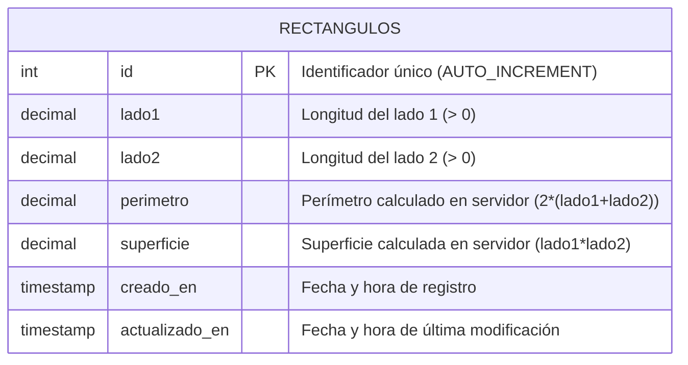
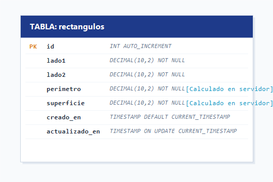

# Diagrama Entidad-Relación - Ejercicio 1: Rectángulos

El siguiente diagrama representa el modelo de datos implementado en MySQL para la administración de rectángulos:

```mermaid
erDiagram
    RECTANGULOS {
        int id PK "Identificador único (AUTO_INCREMENT)"
        decimal lado1 "Longitud del lado 1 (> 0)"
        decimal lado2 "Longitud del lado 2 (> 0)"
        decimal perimetro "Perímetro calculado en servidor (2*(lado1+lado2))"
        decimal superficie "Superficie calculada en servidor (lado1*lado2)"
        timestamp creado_en "Fecha y hora de registro"
        timestamp actualizado_en "Fecha y hora de última modificación"
    }
```

