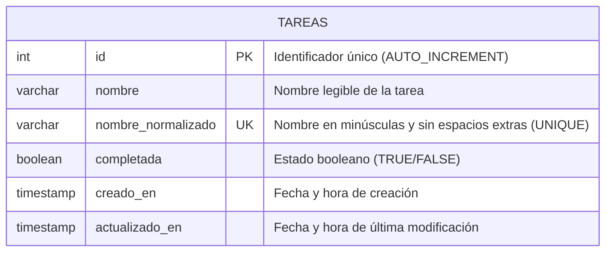
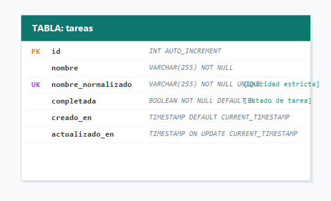

# Diagrama Entidad-Relación - Ejercicio 2: Tareas

El siguiente diagrama representa el modelo de datos implementado en MySQL para la gestión de tareas con unicidad de nombre:

```mermaid
erDiagram
    TAREAS {
        int id PK "Identificador único (AUTO_INCREMENT)"
        varchar nombre "Nombre legible de la tarea"
        varchar nombre_normalizado UK "Nombre en minúsculas y sin espacios extras (UNIQUE)"
        boolean completada "Estado booleano (TRUE/FALSE)"
        timestamp creado_en "Fecha y hora de creación"
        timestamp actualizado_en "Fecha y hora de última modificación"
    }
```

